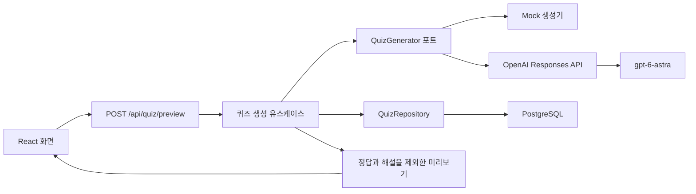

# QuizQuiz 구조

Next.js App Router와 React, TypeScript로 만드는 상식 퀴즈 웹앱이다. PostgreSQL에 사용자·세션·생성 초안을 저장한다. Better Auth로 이메일·비밀번호 로그인을 구현했으며, 원격 호스팅은 Render Web Service(Docker)와 Render Postgres로 결정했다. 테스트·운영 설정은 준비했고 실제 배포는 아직 수행하지 않았다.

## 현재 흐름

- 기본 제공자는 `mock`이다. API 키 없이 구조를 확인할 수 있다.
- 서버 설정에서 `openai`를 선택하면 Astra 생성기를 사용한다. 페이지를 열거나 빌드하는 것만으로 유료 생성 요청을 보내지 않는다.
- 퀴즈 생성 결과는 검토 전 초안이다. JSON 형식 검증을 사실 검증으로 취급하지 않는다.
- 생성된 초안과 정답·해설·생성 이력을 PostgreSQL에 저장한 뒤 미리보기를 반환한다. DB 저장 실패 시 성공 응답을 반환하지 않는다.
- 미리보기 응답에는 정답 인덱스와 해설을 포함하지 않는다. 실제 퀴즈 진행과 채점은 이후 단계다.

## 책임과 의존성

| 위치 | 책임 |
| --- | --- |
| `src/app` | 화면, 레이아웃, HTTP 요청 및 응답 처리 |
| `src/features/quiz/domain` | 문제 형식, 카테고리, 난이도 등 퀴즈 규칙 |
| `src/features/quiz/application` | 생성 유스케이스와 응답용 데이터 구성 |
| `src/features/quiz/ports` | `QuizGenerator`, `QuizRepository` 등 외부 기능의 계약 |
| `src/server/ai` | Mock 및 OpenAI 생성기, 프롬프트와 출력 검증 |
| `src/server/config` | 서버 환경변수 읽기와 검증 |
| `src/server/db` | PostgreSQL 연결 풀과 저장소 구현 |
| `db/migrations` | 버전이 관리되는 SQL 스키마 |

의존성은 화면·HTTP 계층에서 유스케이스로, 유스케이스에서 도메인과 포트로 향한다. 도메인에는 Next.js, OpenAI SDK, DB 클라이언트를 넣지 않는다. 구체적인 생성기는 서버에서 선택해 주입한다.

## PostgreSQL 저장 경계

`QuizRepository`는 도메인 계약이며 `PostgresQuizRepository`가 `pg` 드라이버로 구현한다. `quizquiz.quizzes`에는 생성 정보, `quizquiz.quiz_questions`에는 순서가 있는 문제와 정답을 저장한다. 도메인에는 드라이버나 SQL을 넣지 않는다.

저장 작업은 전체 퀴즈를 하나의 트랜잭션으로 삽입하며 동일한 ID로 기존 초안을 덮어쓰지 않는다. 조회 시에도 도메인 스키마와 문제 수를 검증한다. 현재 데이터는 검토 전 생성 초안이다. Better Auth 사용자·세션·계정 테이블과 퀴즈 소유자 연결을 추가했다. 문제 은행의 게시·검수, 플레이 세션과 제출 답안 테이블은 아직 없다.

로컬 실행·마이그레이션·테스트 방법은 [DB 문서](database.md)에 정리했다. 운영 호스팅을 선택하면 서버의 `DATABASE_URL`을 해당 PostgreSQL 접속 주소로 교체한다.

## 다음 구현 순서

1. 문제 검토 기준과 문제 은행의 게시·검수 모델을 정한다.
2. 퀴즈 플레이 세션·제출 답안 저장을 추가한다.
3. 서버에서 답안을 채점하고 제출 이후 필요한 해설만 반환한다.
4. 이메일 인증·비밀번호 복구와 AI 비용 한도를 추가한다. 인증과 DB 공유 요청 제한은 구현했다.
5. 검증을 마친 문제를 제공하는 운영용 퀴즈 API를 만든다.

개발용 미리보기 API는 운영용 AI 생성 API를 대신하지 않는다. 운영 공개 전에는 인증, 공유 요청 제한, 비용 한도, 오류 관측, 문제 검토 흐름이 필요하다.

공식 참고: [Next.js 설치 및 프로젝트 구조](https://nextjs.org/docs/app/getting-started/installation), [AI 연결 규칙](./ai.md).

## 계정과 화면 흐름

`/signup → /welcome → / → /history`가 첫 진입 흐름이다. `/login`에서 재로그인한다. 인증은 `src/server/auth`의 Better Auth와 `public.auth_*` 테이블을 사용한다. 서버 세션을 직접 확인하며 로그인 상태를 localStorage에 저장하지 않는다.

퀴즈 소유자는 클라이언트 입력에서 받지 않고 서버 세션의 사용자 ID로 지정한다. `owner_id`는 문제와 같은 트랜잭션에서 기록하고, 기록 상세 조회는 사용자 ID로 제한한다. 기존 샘플·비로그인 개발 미리보기는 소유자가 없는 상태로 유지한다.

운영 모드 미리보기는 로그인한 계정의 Mock 문제만 제공한다. `quizquiz.preview_limits`의 원자적 UPSERT로 계정당 분당 10회 제한한다. 개발 모드의 게스트 미리보기는 유지하며 인터넷에 공개하지 않는다.

배포 이미지는 Next.js standalone 출력으로 만든다. `db → migrate → app` 순서로 Docker Compose가 실행한다. 빌드에는 DB 접속 정보나 비밀값을 전달하지 않는다. 자세한 내용은 [배포 문서](deployment.md)에 있다.
