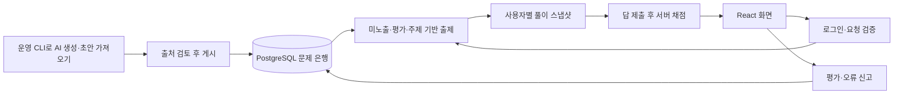

# QuizQuiz 구조

Next.js App Router·React·TypeScript와 PostgreSQL로 만드는 상식 퀴즈 웹앱이다. Better Auth로 로그인하며 Render Web Service(Docker)와 Render Postgres의 staging이 배포되어 있다. 운영 환경은 별도 Blueprint만 준비했다.

## 현재 플레이 흐름

- 플레이 중 AI를 호출하지 않는다. 출처를 확인한 초기 문제 10개를 마이그레이션으로 제공한다.
- 기본 5문제를 출제한다. 미노출·주제·난이도 균형을 우선하고, 평가가 쌓이면 좋은 문제 60%·평가 부족 30%·기타 10% 확률로 뽑는다. 빈 후보군과 작은 문제 은행은 대체 추첨한다.
- 정답과 해설은 서버에 보관하고 해당 문제의 답을 제출한 뒤에만 공개한다.
- 사용자는 실제로 푼 문제에만 평가·신고할 수 있다. 평가 1개를 변경할 수 있고, 서로 다른 계정의 미해결 신고가 3개면 새 출제를 중지한다.
- 검토·출제 정책, 운영 CLI, 초기 제약은 [문제 은행 문서](../quiz/bank.md)에 상세히 정리했다.

## 책임과 의존성

| 위치 | 책임 |
| --- | --- |
| `src/app` | 화면, 레이아웃, HTTP 요청·응답 |
| `src/features/play/domain` | 입력 계약, 출제·평가 점수·보기 섞기 규칙 |
| `src/features/play/ports` | `PlayRepository` 저장 계약 |
| `src/features/play/components` | 출제 설정·풀이·결과·평가 화면 |
| `src/features/quiz` | 기존 생성 초안·미리보기의 도메인·유스케이스·포트 |
| `src/server/play-http.ts` | 서버 세션·동일 출처·공유 요청 제한·오류 응답 |
| `src/server/db` | PostgreSQL 연결 풀과 저장소 구현 |
| `src/server/ai` | 개발용 Mock·Astra 어댑터와 출력 검증 |
| `db/migrations` | 버전이 관리되는 SQL 스키마·초기 문제 |
| `scripts/bank.mjs` | 운영자 전용 초안 가져오기·검토 큐·게시·중지·내보내기 |

도메인은 Next.js·OpenAI SDK·DB 드라이버를 참조하지 않는다. 서버가 구체적인 저장소와 생성기를 선택한다. 비밀값은 서버 환경변수로만 전달한다.

## PostgreSQL 저장 경계

`PostgresPlayRepository`가 `PlayRepository` 계약을 구현한다. 시작 요청 ID는 재시도를 중복 생성하지 않게 하고, 사용자별 출제 잠금과 세션별 답안 잠금으로 동시 요청을 처리한다. 답안은 순서대로 제출하며 같은 답 재전송은 기존 결과를 반환하고 다른 답으로 덮어쓰지 않는다.

플레이 시 문제·보기·정답·해설·출처를 스냅샷으로 저장한다. 이후 게시 상태가 바뀌어도 진행 중인 풀이가 바뀌지 않는다. 조회는 서버 세션의 소유자로 제한하고, 제출 전 정답이 초기 HTML이나 API 응답에 들어가지 않도록 명시적 DTO를 구성한다.

기존 `quizzes`와 `quiz_questions`는 생성 초안이며 플레이 세션과 별개다. AI의 형식 검증을 사실 검증으로 취급하지 않는다. DB 실행과 스키마는 [database.md](../operations/database.md)에 있다.

## 화면과 기존 미리보기

`/signup → /welcome → / → /play/[id] → /play/history`가 플레이 흐름이다. 로그인은 `/login`, 과거 풀이와 이어 풀기는 `/play/history`에서 제공한다.

기존 샘플은 `/preview`, 생성 초안 기록은 `/history`에 유지한다. 개발 환경에서만 설정에 따라 Astra 미리보기를 사용할 수 있고, 운영 미리보기는 로그인한 계정의 Mock 요청만 허용한다. 유료 공개 생성은 차단한다.

배포 이미지는 Next.js standalone 출력이다. 로컬은 `db → migrate → app`, 무료 Render staging은 컨테이너 시작 스크립트에서 마이그레이션 후 앱을 실행한다. 자세한 설정은 [Docker 배포 문서](../operations/docker.md)와 [render.md](../operations/render.md)에 있다.

## 사용자 문제 제출

`/submit`에서 로그인한 사용자가 기존 9개 대분류·49개 소분류로 문제를 제안한다. `src/features/submissions`가 입력 계약·화면·저장 포트를, `src/server/db/submission-repository.ts`가 대기 저장·소유권·제출 한도·운영자 승인 트랜잭션을 담당한다. 공개 API는 `/api/submissions`, 검수는 운영자 CLI만 제공한다. [흐름과 검수 방법](../quiz/community-submissions.md)을 참고한다. AI 호출은 없다.

## 후속 작업

- 소량 생성의 실제 품질·사용량을 검증한 뒤 Batch API 등 대량 처리 검토. 현재 운영자 전용 생성·월 예산 예약·초안 저장은 [구현됨](../ai/generation.md).
- 출처 검토·중복 확인을 거쳐 문제 수 확장, 실제 정답률로 난이도 보정.
- 이메일 인증·비밀번호 복구, 다중 계정 평가 조작 대응.
- 운영 DB 백업·복구와 운영 환경 출시. 현재 무료 staging의 DB 만료 기한 관리.
