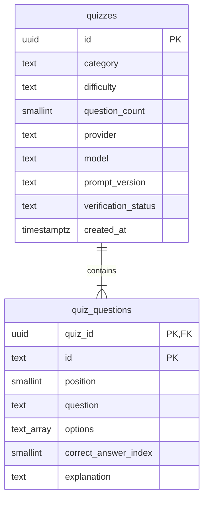

# PostgreSQL

DB 엔진은 PostgreSQL로 확정했다. 현재 `pg` 드라이버와 SQL 마이그레이션, Better Auth를 사용한다. 원격 DB는 Render Postgres를 선택했으며 테스트·운영 DB를 따로 생성할 설정을 준비했다. 실제 원격 DB는 아직 생성하지 않았다. 로컬 Compose는 PostgreSQL 18을 실행한다. 연결 순서는 [Render 시작 가이드](render.md)에 있다.

## 로컬 준비

Node 24, npm 11 이상, 실행 중인 Docker가 필요하다.

```sh
npm ci
npm run db:setup
npm run dev
```

`db:setup`은 다음을 순서대로 실행한다.

1. `.env.local`에 무작위 로컬 비밀번호와 `DATABASE_URL`을 생성한다. 기존 값은 보존한다.
2. `quizquiz` Compose 프로젝트의 PostgreSQL 컨테이너를 실행한다.
3. SQL 마이그레이션을 적용한다.
4. 검토 전 샘플 퀴즈 1개와 문제 3개를 삽입한다. 시드는 반복 실행해도 중복 생성하거나 기존 데이터를 덮어쓰지 않는다.

접속 주소는 `127.0.0.1:5433`, DB와 사용자는 `quizquiz`다. 비밀번호는 Git에서 제외된 `.env.local`의 `POSTGRES_PASSWORD`에 있다. DB 클라이언트에 이 값을 입력하면 된다. 로컬 컨테이너는 개발용 계정을 사용한다. 운영에서는 해당 환경에 맞는 제한된 앱 실행 계정과 마이그레이션 계정을 사용한다.

PostgreSQL 18 이미지의 영속 볼륨은 `/var/lib/postgresql`에 연결한다. `db:down`은 컨테이너와 네트워크를 중지·제거하지만 볼륨은 남긴다. 볼륨을 삭제하는 명령은 기본 스크립트에 넣지 않았다. [공식 이미지 안내](https://github.com/docker-library/docs/blob/master/postgres/README.md)

## 명령

| 명령 | 동작 |
| --- | --- |
| `npm run db:env` | 기존 값을 보존하며 로컬 접속 정보 준비 |
| `npm run db:up` | DB 컨테이너 시작, 준비 상태까지 대기 |
| `npm run db:down` | DB 중지, 데이터 볼륨 보존 |
| `npm run db:migrate` | 미적용 SQL 마이그레이션 실행 |
| `npm run db:seed` | 고정된 로컬 샘플 삽입 |
| `npm run db:status` | 연결 및 마이그레이션·퀴즈·문제 개수 확인 |
| `npm run test:db` | 격리된 임시 DB에서 실제 PostgreSQL 통합 테스트 |

Docker가 꺼져 있으면 설정 파일과 일반 코드 검사는 가능하지만 실제 마이그레이션과 DB 테스트는 실행할 수 없다. DB가 없는 상태의 미리보기 요청은 503으로 실패한다. 자동으로 메모리 저장소로 전환하지 않는다.

## 스키마



기존 퀴즈 테이블과 `schema_migrations`, `preview_limits`는 `quizquiz` 스키마에 있다. Better Auth 테이블은 `public`에 `auth_` 접두사를 사용한다. `schema_migrations`에는 적용한 파일 이름, SHA-256 체크섬, 적용 시간을 기록한다.

`quizzes`는 생성 초안의 묶음이다. 사용자별 플레이 세션이 아니다. 문제 ID는 초안 내부에서만 유일하며 복합 기본키 `(quiz_id, id)`로 관리한다. `position`으로 문제 순서를, PostgreSQL `text[]`로 보기 순서를 보존한다. 정답 인덱스는 0부터 3까지다.

현재 검토 상태는 `unreviewed`만 허용한다. 게시·검수 단계가 필요해지면 새 마이그레이션과 도메인 변경을 함께 추가한다. 사용자·인증 세션은 `0002_auth.sql`, 퀴즈 소유자·사용량 제한은 `0003_quiz_owners.sql`에 추가했다. 플레이 세션·제출 답안은 후속 작업이다.

## 저장 규칙

- `PostgresQuizRepository.save`는 퀴즈와 모든 문제를 같은 연결의 트랜잭션으로 저장한다. 중간에 실패하면 전체를 롤백한다. [pg 트랜잭션](https://node-postgres.com/features/transactions)
- 저장된 초안은 불변이다. 같은 ID를 다시 삽입해 기존 내용을 덮어쓰지 않는다.
- 조회는 한 SQL 문으로 일관된 스냅샷을 읽고 도메인 스키마와 문제 개수를 재검증한다.
- SQL 값은 매개변수로 전달한다. 서버 전용 모듈만 DB에 연결하고 브라우저에는 정답·해설을 제외한 DTO를 반환한다.
- 앱은 지연 생성한 최대 5개 연결의 풀을 재사용한다. 개발 중 접속 주소를 바꾸면 서버를 재시작한다. [pg 연결 풀](https://node-postgres.com/features/pooling)
- 운영 인스턴스가 늘면 전체 연결 수와 제공업체의 연결 풀 설정을 함께 조정한다. TLS 설정은 제공업체의 접속 안내에 맞추며 인증서 검증을 임의로 끄지 않는다.

## 변경과 검증

이미 적용한 SQL 파일을 수정하면 체크섬 검사에서 실패한다. `0002_설명.sql` 형태로 새 마이그레이션을 추가한다. 명령은 동시 실행을 잠금으로 직렬화하고 트랜잭션으로 적용한다. 기본 스크립트에 자동 초기화나 다운 마이그레이션은 없다.

일반 `npm test`는 Mock AI와 저장소 대역을 사용한다. `npm run test:db`는 로컬 `quizquiz` DB의 관리 연결로 이름이 무작위인 임시 DB를 만들고 마이그레이션·시드 재실행, 저장/조회, 실패 롤백, DB 제약과 공개 응답을 검증한다. 종료 시 자신이 만든 임시 DB만 삭제한다. 외부 호스트에서는 이 테스트가 실행되지 않도록 제한했다.

원격 PostgreSQL을 사용하려면 서버의 `DATABASE_URL`을 설정하고 `npm run db:migrate`를 실행한다. 로컬용 `db:up`이나 샘플용 `db:seed`는 운영 배포 절차가 아니다.

## 인증과 소유자

- `public.auth_user`: 이메일·닉네임·이메일 인증 상태.
- `public.auth_account`: 인증 제공자와 비밀번호 해시. 평문 비밀번호를 저장하지 않는다.
- `public.auth_session`: 만료 기한이 있는 세션. 로그아웃 시 서버에서 폐기한다.
- `public.auth_verification`: 향후 이메일 인증·복구에 쓰는 공식 스키마.
- `public.auth_rate_limit`: 인증 요청 제한 상태.
- `quizquiz.quizzes.owner_id`: 사용자 FK. 기존 익명 데이터는 NULL. 로그인한 문제는 사용자 삭제 시 함께 삭제된다.
- `quizquiz.preview_limits`: 계정당 분당 미리보기 요청 수. 여러 서버의 동시 요청에도 10회 상한을 원자적으로 확인한다.

인증 SQL은 설치된 Better Auth 스키마에서 생성하고 public 스키마를 명시했다. 이미 적용한 파일을 변경하지 않는다. 인증 라이브러리 업그레이드 시 필요한 스키마 차이를 새 마이그레이션으로 추가한다.
